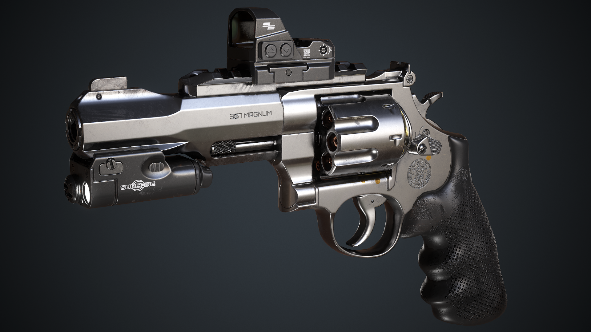

# Carlos Martín Ibarra

Buenas, me llamo Carlos, mis amigos me dicen "Chacky" debido a mi obsesión con la saga de películas "Child's Play"; tengo 25 años y, desde que tengo uso de razón, me fascinan los videojuegos. Comencé a la tierna edad de 5 años, cuando mi primo me regaló la Sega Génesis, eventualmente recibí la Play Station 2 de parte de mis padres y finamente conocí lo mejor de lo mejor en cuanto a gaming se refiere, la computadora de escritorio. Pase toda mi adolescencia jugando la mayor cantidad de horas posibles y aunque a día de hoy no tengo tiempo para jugar, los videojuegos seguirán ocupando una parte importante en mi vida.

Actualmente me desempeño como freelance, diseñando modelos 3D para videojuegos. Además estoy cursando segundo año de la carrera de Diseño de Videojuegos, en la cual conocí a dos personas con las que conformé un pequeño equipo de trabajo, teniendo un músico a disposición y un programador experimentado.

Mi plan a futuro es llevar a cabo los proyectos que tengo en mente, tanto como los que mis compañeros puedan llegar a proponer, y que ello genere el ingreso suficiente para vivir dignamente, e ir encarando proyectos de mayor envergadura.

## Mis intereses:
* Diseño de Videojuegos
* Modelado 3D
* Programación
* Escritura (Ficción/Poesía)
* Anime
* Política
* Psquiatría/Psicología

## Mi mejor Modelo 3D (por ahora):

